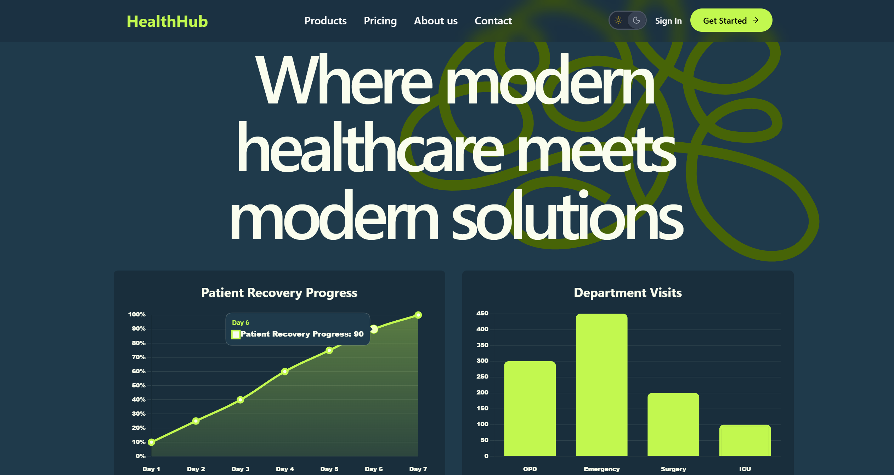
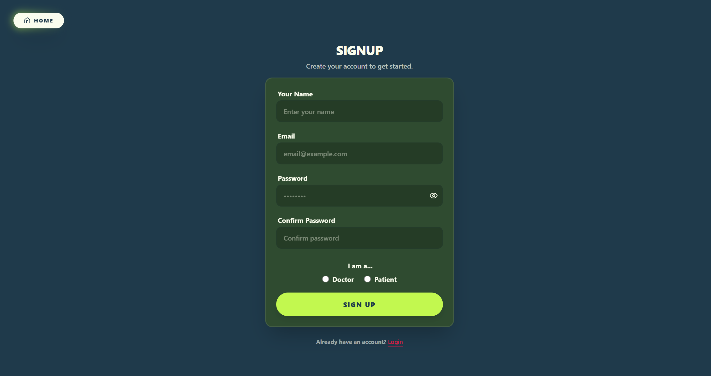
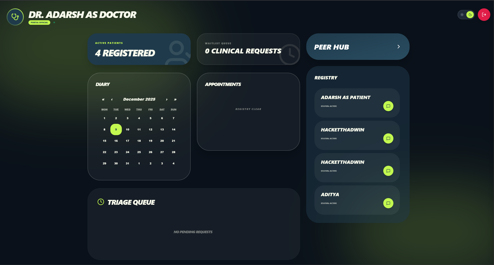
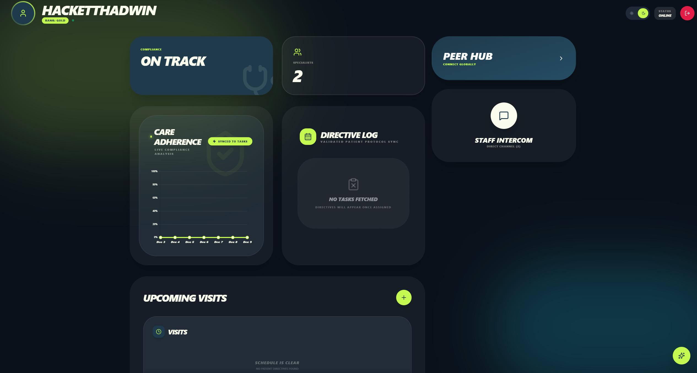
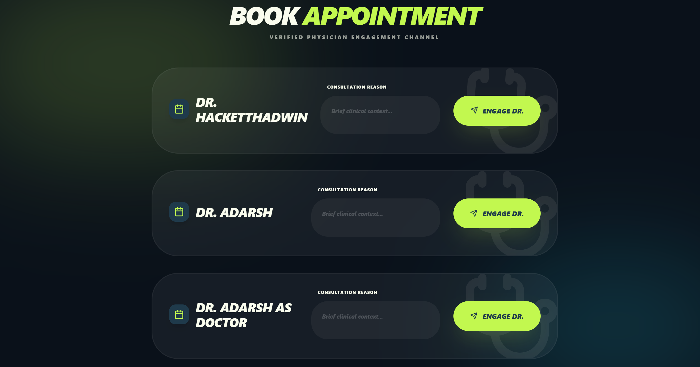
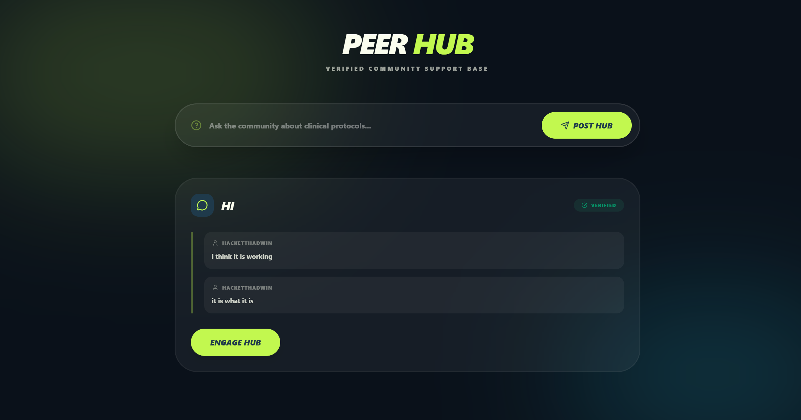
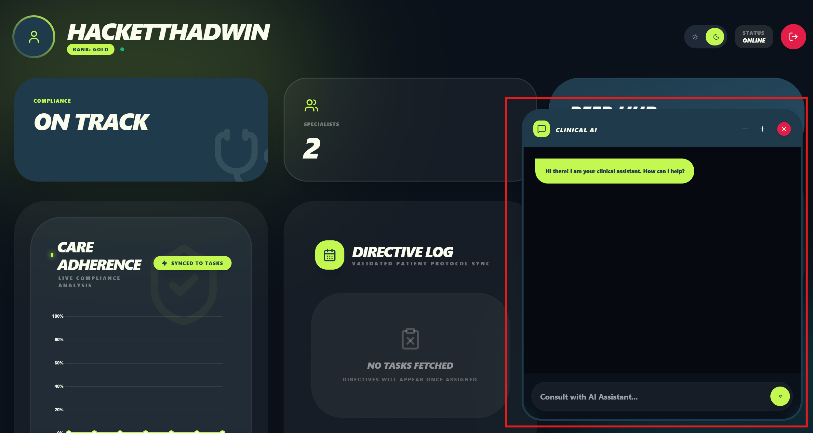

# 🏥 HealtHub

A full-stack healthcare web application designed to bridge the gap between patients and doctors using real-time appointment scheduling, communication, task management, and data visualization. Built with the **MERN stack (MongoDB, Express, React, Node.js)**, this platform empowers both patients and doctors with a seamless, intuitive interface, secure login system, and actionable insights.

### Working Link : https://healthub-six.vercel.app/

## 📸 Screenshots

### Home Page

### Signup Page

### Doctor's Page

### Patient's Page

### Book Appointment with Doctor

### Community Support Panel

### AI Chatbot

## ⚙️ Features

### 👩‍⚕️ Doctor Dashboard
- View a list of patients with symptoms
- Manage appointment requests (Accept/Reject)
- Cancel confirmed appointments
- Full calendar view with scheduling
- Chat interface with patients (Mobile + Desktop Responsive)
- Community support and discussion

### 🧑 Patient Dashboard
- Book an appointment with a doctor
- View and manage upcoming appointments
- Real-time communication with assigned doctor
- Community support area to ask general health questions

### 🔐 Authentication
- JWT-based login system
- Role-based protected routes for doctors and patients
- Auto-navigation to role-specific dashboards

### 🎨 UI/UX
- Mobile and desktop responsive layouts
- Toast notifications for feedback
- Sidebar/chat drawer
- Integrated calendar using `react-calendar`

---

## 🧑‍💻 Tech Stack

| Category     | Technology                |
|--------------|---------------------------|
| Frontend     | React, Tailwind CSS       |
| Backend      | Node.js, Express.js       |
| Authentication | JWT, bcrypt              |
| Database     | MongoDB + Mongoose        |
| Chat      | WebSockets (Socket.io) |
| UI Components| react-calendar, react-toastify |
| Hosting      | Render (Backend), Vercel (Frontend) |

---

