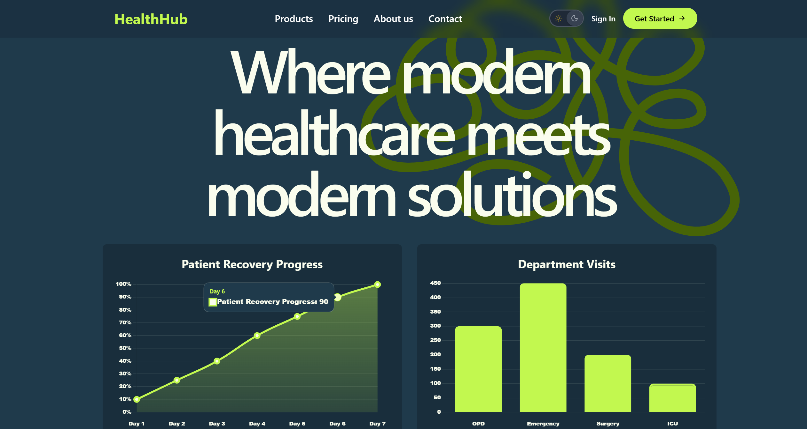
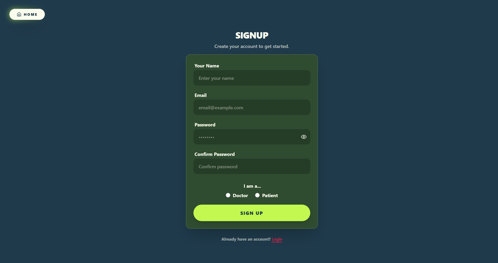
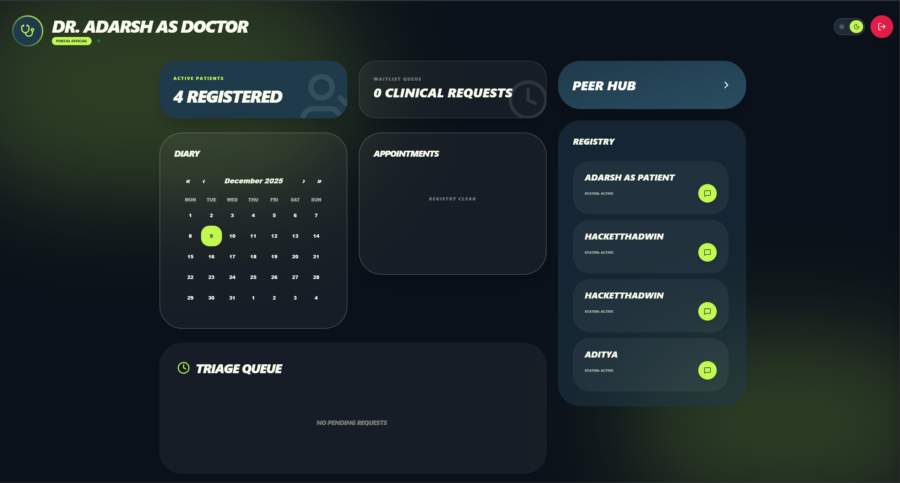
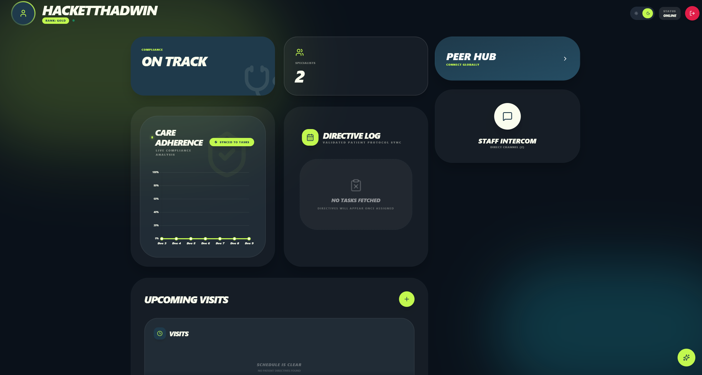
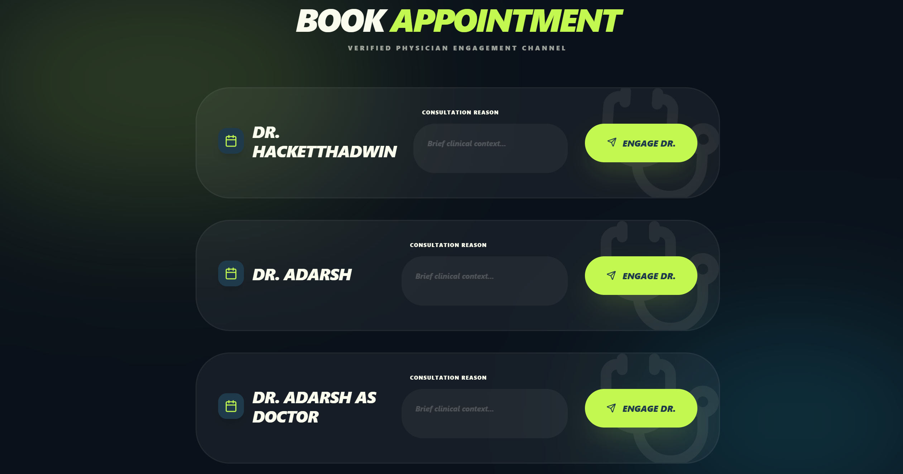
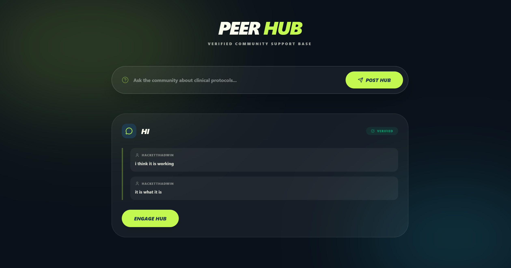
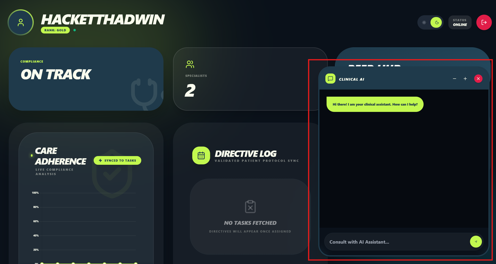

# HealthHub - Healthcare Management Platform

A full-stack healthcare web application connecting patients and doctors through real-time appointment scheduling, secure communication, and collaborative community support. Built with the MERN stack for seamless, responsive healthcare management.

**🔗 Live Demo:** https://healthub-six.vercel.app/

---

## 🎯 What Makes This Different?

- **Real-Time Communication** - WebSocket-based chat between doctors and patients
- **Role-Based Dashboards** - Distinct interfaces for doctors and patients with tailored functionality
- **Appointment Management** - Full calendar integration with accept/reject workflows
- **Community Support** - Public discussion area for general health questions
- **AI Integration** - Chatbot for instant health query responses
- **Mobile Responsive** - Fully functional on both desktop and mobile devices

---

## ✨ Key Features

### 👨‍⚕️ Doctor Dashboard

- **Patient Management** - View patient list with symptoms and medical history
- **Appointment Control** - Accept/reject incoming requests, cancel confirmed appointments
- **Calendar View** - Full scheduling interface with availability management
- **Real-Time Chat** - Direct messaging with patients (mobile + desktop responsive)
- **Community Moderation** - Participate in and monitor health discussions

### 🧑‍💼 Patient Dashboard

- **Doctor Discovery** - Browse available doctors and specializations
- **Appointment Booking** - Schedule consultations with preferred doctors
- **Appointment Tracking** - View upcoming and past appointments
- **Direct Messaging** - Real-time chat with assigned doctor
- **Community Access** - Ask questions and engage with health community

### 🔐 Authentication & Security

- **JWT-Based Auth** - Secure token-based authentication system
- **Role-Based Access** - Protected routes for doctors vs. patients
- **Password Encryption** - Bcrypt hashing for secure credential storage
- **Auto-Navigation** - Redirects users to role-specific dashboards

### 💬 Communication Features

- **WebSocket Chat** - Real-time messaging using Socket.io
- **Notification System** - Toast notifications for all user actions
- **Community Forum** - Public discussion area for health queries
- **AI Chatbot** - Instant responses to common health questions

---

## 📸 Screenshots

### Home Page

### Authentication

### Doctor Dashboard

### Patient Dashboard

### Appointment Booking

### Community Support

### AI Chatbot

---

## 🛠️ Tech Stack

| Category | Technology |
|----------|-----------|
| **Frontend** | React, Tailwind CSS |
| **Backend** | Node.js, Express.js |
| **Database** | MongoDB, Mongoose |
| **Authentication** | JWT, bcrypt |
| **Real-Time** | Socket.io (WebSockets) |
| **UI Components** | react-calendar, react-toastify |
| **Deployment** | Vercel (Frontend), Render (Backend) |

---

## 🤝 Contributing

Contributions welcome! Areas for improvement:
- Video consultation integration
- Payment gateway integration

---

**⭐ Star this repo if you find it useful!**

[Report Bug](../../issues) · [Request Feature](../../issues)

